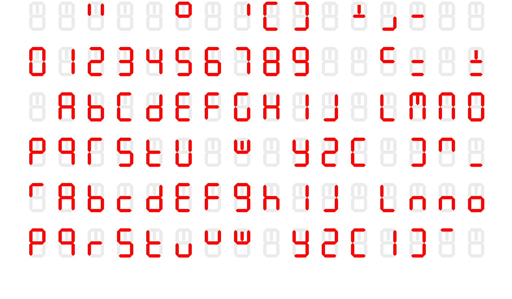

# ALSA Driver for Novation Impulse Control Interfaces

This is an auxiliary driver for Novation Impulse MIDI Controllers. These MIDI controllers were originally shipped with a program called Automap that would allow the custom binding of controls to DAW plugins and supported DAW mixer controls. The Automap software interfaced to the Controllers via 2 proprietary USB interfaces (interface numbers 2 and 3) with interrupt endpoints. In the Windows version of Automap a custom streaming media device driver was used to access these interfaces.

The Plugin control mode for the keyboard is available by sending SYSEX messages to the standard MIDI ports on the device without any special software. This had been reverse engineered and there are a number of openly available unofficial plugins for DAWs such as FLStudio and Bitwig that allow custom mapping of controls and writing to the display. However the behavior of the keyboard is slighly different than when the proprietary interfaces are used. 

The Keyboard has 3 "zones" of control: the mixers/faders, the knobs, and the pads. Each zone can be enabled individually. When all 3 zones are enabled via the standard MIDI port it does alter the behavior of the Mod wheel to only output on channel 3, regardless of how the keyboard template is setup. However, if the control mode is enabled through the non-standard MIDI interface/ports then it does not alter the Mod wheel output.

## Modes
The controller has distinct modes changed by command 67 06 as listed below and the behavior differs depending on whether they are sent to the standard MIDI port or to one of the special interrupt endpoints (which this will call "control port" - not to be confused with USB control endpoint).
The control port is available on the additional vendor class interfaces. There are two vendor interfaces (#2 and 3) each with output and input endpoints. Interface 2 Endpoint 3 and Interface 3 Endpoint 5 are outputs and there does not seem to be any difference in function.
Interface 2 Endpoint 4 receives control update messages from the all the controls except the knobs section. Endpoint 6 receives control updates from the knobs. The Shift key sends updates on both endpoints: (Ch1 CC#39 Val x on IF 2 and Ch2 CC#13 Val x on IF 3 where x is 1/0 for press/release).

There are strictly 3 states (modes) for the faders/mutes, 3 states for the knobs and 2 states for the pads. The pads are either in Mode A or B, where mode B allows Clip Launch activation from the keypad and mode A does not. Note there does not appear to be a way to directly enable Clip Launch from MIDI commands. Mode A for the other zones means Plugin mode disabled - ie just allow MIDI mode. Mode B is Plugin mode enabled without labels, and Mode C is with labels.
When in Mode B manipulating a control sends its respective control change message to the activated port. When in Mode C manipulating a control sends its control change message and updates the display to show the current control label and the current associated control value (for faders and knobs this is set by sending the respective control change message). Crucially, if the control does not have an associated label it will display "No Ctrl". In Mode A the Mixer/Plugin buttons send a control message on their respective control port, this was likely used as the trigger for Automap.

The mode settings for the control port and the main MIDI port are independent, but they interact.
If *any* of the zones are set to a control mode on the main MIDI port, then all of control messages are sent out the main MIDI port. For example if knobs are set to Mode C with MIDI Ctrl Port: 67 06 00 01 00 and then pads Mode B is enabled via the Main MIDI port 67 06 00 00 01, then the knobs control traffic will start to come out the main MIDI port. Note that the mode setting controls of the main MIDI port and control port are independently stored. If all modes are reset to A on the main MIDI port in the preceding example, then the knobs control will continue to be in Mode C with control change now resuming coming from the control port.

Only Mode A and Mode C seem to be available for the faders/knobs when accessed from the control port.
* Main MIDI Port: 67 06 01 01 01: This seems to be a special case. Everything is placed in Mode B. Additionally, the Mod Wheel output is a fixed controller output on channel 2.
* Main MIDI Port: 67 06 0x 0y 0z: Where x, y, and z are not all 1. In this case, the the fader and knob banks will be in Mode C or Mode A.
* Control MIDI Port: 67 06 0x 0x 0z: x and y will set the faders and knobs respectively between Mode A and C, and z will set Mode A or B for the pads. There does not seem to be a way to get Mode B for the faders/knobs from the control port.

The mode switching is therefore not completely flexible. If you wish to enable all zones in a control mode from the main MIDI port, then labels are not available. Current 3rd party plugins all tend to set the display text with 67 08 and 67 09. A workaround is to simply enable the pad to Mode B via the control port, and enable the other zones on the Main MIDI port. As noted above, if one zone is configured on the main MIDI port, then all control messages are sent out that port, so the pad output will be redirected to the main MIDI output while allowing Mode C/label mode for the fader and knob zones.

## MIDI Messages

All Sysex messages begin with the preamble F0 00 20 29 which is the Focusrite/Novation header and they end with the trailer F7. The preamble and trailer will be omitted in the following:

* 00 70: Get firmware version: Example response: 00 70 00 00 06 05 08 00 00 06 09 03 0D -> Boot version: 658, Main version: 693
* 67 06 0x 0y 0z: Device inquiry and enabling control mode for each zone. x = 1 to enable fader zone, y = 1 to enable knob zone, z = 1 to enable pad zone. Device responds with device ID: 67 0x xx, where device ID is xxx. 719 for Impulse 25, 71A for Impulse 49 and 71B for Impulse 61.
* 67 05 0x yy 00 [Up to 72 bytes of ASCII text]: Control label assignment for zone x (0 = faders, 1 = buttons, 2 = knobs). The 72 characters of text are 8 bytes for each control starting from left to right and top to bottom with the 9th byte being 20h (ASCII Space). This allows setting persistent text labels to each control when the controller is in Plugin mode. The controller also stores a value for each of the controls that defaults to 0 which can be set by sending the corresponding MIDI control message with the value desired. Sending the control value to a button controller only seems to set the LED. When pressing the button it will display the value 0. No way to change this displayed value has been found.
The yy byte is the offset of where to begin writing in the block. The last 00 byte does not have a known function, if it is not 0, the command doesn't seem to do anything.
* 67 08 [Up to 64 bytes of ASCII text]: Show the text on the full text display. The width of this display is 8 characters, so anything more than 8 characters will cause a repeating scrolling display. The device will also trim whitespace from the string.
* 67 09 [3 bytes ASCII]: Display text in the 7/8-segment numeric display area. Note the first character is an 8 eight segment display (it has a center top vertical segment) and can display characters such as capital M, that the other two cannot. If no bytes after the command are sent, the display show '0 t' (possibly random garbage).
* 43 00 00 [template data]: Write template data to RAM in the current template bank.

## Character Table for 3 digit display

